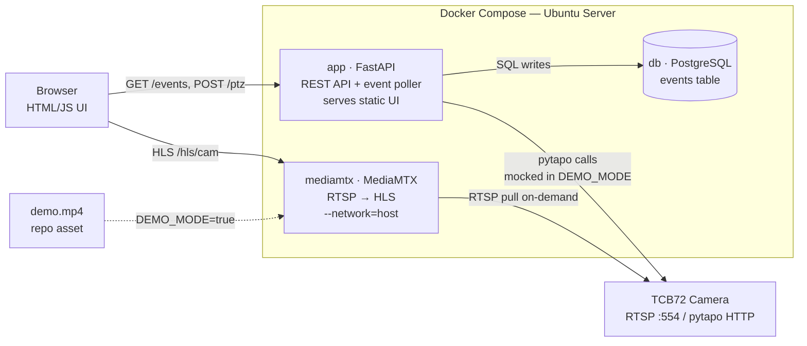

# home-telemetry-analytics

## Project Overview

A home telemetry system that streams data from a TP-Link TCB72 camera to a home PC and builds applications on top of that data. The goal is to move beyond the Tapo app and build custom, programmable access to the camera feed and events.

## Camera Hardware

- **Model**: TP-Link TCB72 (Tapo-branded, Pan/Tilt, 2K QHD, 4MP)
- **Protocols confirmed supported**: RTSP (port 554), ONVIF Profile S (port 2020)
- **No official developer API** from TP-Link

## Connectivity

### RTSP Stream
- Main stream (high quality): `rtsp://<username>:<password>@<camera_ip>:554/stream1`
- Sub stream (lower res): `rtsp://<username>:<password>@<camera_ip>:554/stream2`
- Requires a **camera account** created in the Tapo app (separate from Tapo login credentials): Settings > Advanced Settings > Camera Account
- Max 2 simultaneous RTSP streams
- **Third-Party Compatibility must be enabled**: Tapo App > Me > Tapo Lab > Third-Party Compatibility > On

### ONVIF
- Port: 2020
- Profile S
- Enables motion events, PTZ control (pan/tilt supported on TCB72)
- Does not work simultaneously with SD card + Tapo Care (pick two of the three)

### pytapo (Unofficial Python Library)
- Repo: https://github.com/JurajNyiri/pytapo
- Reverse-engineered Tapo protocol; no official API backing
- TCB72 is **not explicitly listed** in confirmed supported models
- Confirmed models are C-series and TC-series cameras
- Likely compatible since TCB72 is Tapo-based, but treat as unverified until tested
- Provides: camera controls, motion event queries, PTZ, SD card recording downloads, privacy mode, reboot
- **Risk**: Tapo firmware updates have historically broken pytapo (encryption protocol change in late 2024 is a documented example). Treat as supplemental layer only; ONVIF is the primary path for motion events and PTZ.

### MediaMTX (Protocol Bridge and Stream Server)
- Repo: https://github.com/bluenviron/mediamtx — open source, MIT license, free
- Official Docker image: `bluenviron/mediamtx`
- Ingests RTSP from the camera and re-serves as WebRTC (sub-second latency) or HLS (2-6s latency) to browsers
- Supports on-demand stream pulling: only connects to the camera when a client is actively consuming
- Handles file-based restreaming via ffmpeg (used for demo mode)
- **Must run with `--network=host` in Docker** — Docker's default bridged NAT changes UDP source ports, which breaks RTSP session tracking. This is documented by MediaMTX and is a Linux-only Docker feature; works correctly on headless Ubuntu.
- Acts as the single RTSP consumer from the camera, rebroadcasting internally to unlimited consumers, bypassing the camera's 2-stream limit

## Development Setup

- **Planning machine**: Windows PC, Cowork (Claude desktop app), working directory at `C:\Peter\projects\home-telemetry-analytics`
- **Development machine**: Separate computer running Claude Code CLI
- **Repo**: https://github.com/Dekole/home-telemetry-analytics
- **Workflow**: Plan and document here, commit, pull and implement on dev machine via Claude Code

## Key Constraints and Notes

- RTSP is the primary, reliable path for streaming video frames to the PC
- ONVIF gives camera control and motion events beyond what RTSP provides
- pytapo adds programmatic camera control but is unofficial and may break on firmware updates; use ONVIF as primary
- SD card + Tapo Care + ONVIF/NVR cannot all run simultaneously; pick two
- Tapo cameras expect API messages in sequential order; parallel calls cause auth errors
- Browsers cannot play RTSP natively; all browser video delivery must go through MediaMTX (WebRTC or HLS)
- Camera supports max 2 simultaneous RTSP streams; all internal consumers must connect via MediaMTX, not directly to the camera
- ONVIF WS-Discovery uses multicast and does not work from inside a bridged Docker container; connect to camera by direct IP instead
- ONVIF motion event reliability on Tapo cameras is variable; use pull-point subscriptions (not polling) as the primary approach, with polling as fallback
- Rolling 30-min buffer at 3-5 Mbps (stream copy, no re-encode) = ~700MB-1.1GB; use FFmpeg segment mode writing .mkv files with rotation logic; use stream1 if audio is required in the buffer
- On-demand stream pulling (MediaMTX feature): the RTSP connection to the camera should only be active when a client is consuming; this supports the requirement to not stream in the background when the app is idle. The event collector must use ONVIF directly (not RTSP) so it can run continuously without holding a stream open.

## Architecture Notes

### Confirmed Stack Components
- **MediaMTX**: Core infrastructure service. Single RTSP consumer from camera; rebroadcasts to browser via HLS (v1) or WebRTC (post-demo). Runs in Docker with `--network=host`.
- **Backend**: FastAPI (Python) — natural fit given pytapo is Python and ONVIF libraries are Python-native.
- **Database**: PostgreSQL — implied by JSONB in event schema; correct choice.
- **Rolling buffer**: FFmpeg in segment mode, stream copy, .mkv output with rotation. Separate concern from the live viewer. Near-future requirement.
- **All services run in Docker Compose** on headless Ubuntu. Services needing camera network access use `--network=host`.

### Architecture Diagram



### V1 / Demo Architecture (locked)
Goal: working demo as fast as possible. These decisions are intentional tradeoffs, not oversights.

- **3 containers only**: `app` (FastAPI), `db` (PostgreSQL), `mediamtx`
- **pytapo is the sole camera API for v1**. ONVIF is deferred to post-demo production hardening. Risk accepted: pytapo may break on firmware updates.
- **Event collector runs in-process** inside the FastAPI app as an asyncio background task. Separate container deferred to post-demo.
- **HLS via MediaMTX** for browser video in v1. WebRTC deferred (simpler config, sufficient for demo).
- **Demo mode** (`DEMO_MODE=true`): pytapo client swapped for a mock class emitting synthetic events on a timer; MediaMTX loops a local `.mp4` instead of camera RTSP; PTZ commands hit mock and return success.

### V1 Build Order

**Phase 1 — Infrastructure skeleton**
- `docker-compose.yml` with all 3 containers, env var wiring, volume mounts
- MediaMTX config: loops `demo.mp4` as HLS at `/hls/cam`
- FastAPI boots with `GET /health` returning 200
- PostgreSQL up with schema from `db/init.sql`
- ✅ Done when: `docker-compose up` runs clean; `curl localhost:8000/health` returns `{"status":"ok"}`; `curl localhost:8888/hls/cam/index.m3u8` returns an HLS playlist

**Phase 2 — Video + UI shell**
- Static HTML/JS served from FastAPI at `/`
- Video player consuming HLS from MediaMTX
- Two-column layout matching `ui-mockup.html`
- Header with Live/Offline badge and Demo Mode indicator
- Video overlays: protocol+resolution label (bottom-left), wall clock (bottom-right), mute toggle (top-right)
- PTZ d-pad rendered but not yet wired to backend
- ✅ Done when: browser at `localhost:8000` shows looping demo video with correct layout; mute toggle works; clock ticks

**Phase 3 — Events**
- `GET /events` endpoint with `type`, `limit`, `offset` query params
- Mock event generator running as asyncio background task (see Mock Event Spec)
- Event log in UI polling `/events` every 5s
- Filter chips (All / Motion / Person) functional
- CSV export downloads filtered set
- ✅ Done when: events appear in UI within 30s of startup; filter chips show correct subsets; CSV download contains correct rows and columns

**Phase 4 — PTZ controls**
- `POST /ptz` endpoint; mock handler logs direction and returns `{"status":"ok"}`
- D-pad buttons wired; each fires correct direction; center fires `home`
- ✅ Done when: each button click produces a `200 {"status":"ok"}` response visible in browser dev tools

**Phase 5 — Live camera**
- Swap mock camera client for real pytapo using env vars
- MediaMTX pointed at real RTSP URL via `CAMERA_IP` / `CAMERA_USER` / `CAMERA_PASSWORD`
- `DEMO_MODE=false` in `.env`
- ✅ Done when: real camera feed appears in browser; real motion events appear in event log; PTZ buttons physically move the camera

### Mock Event Spec

The asyncio background task in `collector.py` emits synthetic events when `DEMO_MODE=true`. Rules:

- **Interval**: random 10-20 seconds between events
- **Mix**: 70% `motion`, 30% `person`
- **device_id**: `"tcb72-demo"`
- **timestamp**: UTC now at time of insertion
- **details payload by type:**

```json
// motion
{ "confidence": 0.85, "zone": "full_frame" }

// person
{ "confidence": 0.92, "count": 1 }
```

The same `collector.py` module is used in live mode — only the camera client it calls is swapped. The DB write path is identical in both modes.

### Post-Demo Upgrades
- Swap ONVIF in as primary for motion events and PTZ (retire pytapo dependency)
- Extract event collector into a separate container
- Upgrade HLS to WebRTC for sub-second latency
- Add rolling 30-min buffer (requirement 9)

### On-Demand Streaming
- MediaMTX supports on-demand RTSP pulling (only connects to camera when a browser client is active)
- This satisfies the requirement to not stream in the background when no user is present

## UI Design

Reference mockup: `ui-mockup.html` in the repo root. Open in a browser for a live preview.

### Layout
- Single-page application — no navigation, everything on one screen.
- Two-column layout: video panel + PTZ controls (left), event log (right, fixed ~280px wide).
- Header: app name, device name, connection status badge (Live/Offline), demo mode indicator.

### Header
- Connection status shown as a colored pill badge (green = Live, appropriate color for Offline).
- When `DEMO_MODE=true`, a "Demo mode" badge is visible in the header at all times.

### Video Panel
- Video occupies the full left column width above the PTZ controls.
- Overlay (bottom-left): stream protocol and resolution label (e.g., `WebRTC · stream1 · 2K`).
- Overlay (bottom-right): live wall clock (HH:MM:SS).
- Overlay (top-right): mute/unmute toggle button. Default state: muted.

### PTZ Controls
- D-pad grid: up, down, left, right arrow buttons plus a center home-position button.
- Sits directly below the video panel, left-aligned.

### Event Log
- Displays all historical events from the database (not session-scoped).
- Filter chips at top: All, Motion, Person. Default: All.
- CSV export button exports the currently filtered set.
- Each row is a single line: colored dot indicator + full timestamp (`YYYY-MM-DD HH:MM:SS` in monospace) + event type badge.
- Event type colors: Person = blue, Motion = amber.
- Footer shows total event count for the active filter.

## Repo Structure

```
home-telemetry-analytics/
├── docker-compose.yml
├── .env.example
├── CLAUDE.md                     # must stay in root — Claude Code reads it from here
├── demo.mp4                      # pre-recorded demo video (gitignored if >100MB)
├── docs/
│   ├── ui-mockup.html            # UI reference mockup, open in browser for live preview
│   ├── claude_readme.md          # onboarding guide for new machines
│   ├── hta_mockups_architecture.drawio
│   └── p_hta.skill               # Cowork skill file
├── app/
│   ├── Dockerfile
│   ├── requirements.txt
│   ├── main.py                   # FastAPI entry point, mounts router + starts background task
│   ├── api/
│   │   ├── events.py             # GET /events
│   │   └── ptz.py                # POST /ptz
│   ├── camera/
│   │   ├── client.py             # pytapo wrapper (live mode)
│   │   └── mock.py               # mock client (DEMO_MODE=true)
│   ├── collector.py              # asyncio background task — polls camera, writes to DB
│   ├── db.py                     # DB connection + query helpers
│   ├── models.py                 # Pydantic models shared by API and DB
│   └── static/
│       ├── index.html            # single-page UI
│       ├── app.js                # UI logic (video player, event log, PTZ controls)
│       └── style.css
├── mediamtx/
│   └── mediamtx.yml              # MediaMTX config (RTSP source, HLS output)
└── db/
    └── init.sql                  # PostgreSQL schema (run on first container start)
```

## API Reference

### GET /events
Returns all events from the database, optionally filtered.

**Query parameters:**
- `type` — `motion` | `person` | `all` (default: `all`)
- `limit` — integer, max rows returned (default: `200`)
- `offset` — integer, pagination offset (default: `0`)

**Response:**
```json
{
  "events": [
    {
      "event_id": "uuid",
      "timestamp": "2024-01-15T10:30:00Z",
      "device_id": "tcb72-01",
      "event_type": "motion",
      "details": { "confidence": 0.85, "zone": "full_frame" }
    }
  ],
  "total": 42
}
```

### POST /ptz
Sends a pan/tilt command to the camera (or mock in DEMO_MODE).

**Request body:**
```json
{ "direction": "up" }
```
`direction` must be one of: `up` | `down` | `left` | `right` | `home`

**Response:**
```json
{ "status": "ok" }
```

### GET /health
Returns app status. Used by the UI to set the Live/Offline badge.

**Response:**
```json
{
  "status": "ok",
  "demo_mode": true,
  "camera_connected": false
}
```

## Environment Variables

Defined in `.env`, templated in `.env.example`. All camera vars are ignored when `DEMO_MODE=true`.

| Variable | Default | Notes |
|---|---|---|
| `DEMO_MODE` | `false` | Set `true` to use mock camera + demo.mp4 |
| `DATABASE_URL` | `postgresql://hta:hta@db:5432/hta` | Matches docker-compose db service |
| `CAMERA_IP` | — | Local IP of TCB72 on your network |
| `CAMERA_USER` | — | Camera account username (not Tapo login) |
| `CAMERA_PASSWORD` | — | Camera account password |
| `MEDIAMTX_INTERNAL_URL` | `http://mediamtx:9997` | MediaMTX API, used for health checks |

## Application Requirements

### Core (Current)

1. Application shall be hosted on a headless Ubuntu server, running in Docker containers.
2. The application supports a single camera instance.
3. The application shall include a background event collector service that runs continuously, polling ONVIF/pytapo for motion events and camera state changes, and logging them to a database.
4. The application shall include a stream viewer that displays live video and audio from the camera via RTSP. Audio shall be muted by default, with a mute/unmute toggle overlaid on the video panel. No fullscreen toggle is required.
5. The event log shall store all captured events with the following schema: `event_id` (PK), `timestamp`, `device_id`, `event_type`, `details` (JSON/JSONB).
6. The application shall provide a web UI, accessible from another computer on the network, that displays the full historical event log (all events ever recorded, not session-scoped). The event log shall support filtering by event type (e.g., All / Motion / Person) and CSV export of the visible filtered set. Each row displays timestamp (full date and time, `YYYY-MM-DD HH:MM:SS`) and event type as a color-coded badge, one row per event.
7. The application shall allow manual pan/tilt control of the camera via the web UI using a D-pad style control (up, down, left, right) with a center button to return the camera to its home position.
8. The application shall include a demo mode, configurable via an environment variable (e.g., `DEMO_MODE=true`), that substitutes a pre-recorded RTSP stream (served via MediaMTX) and mocks ONVIF responses, making the full application demonstrable without a physical camera.

### Near-Future

9. The application shall maintain a rolling 30-minute recording buffer of the camera stream, written to disk.

### Future

10. The application shall support automated pan/tilt control.
11. The application shall support analysis and visualization of captured event data.

## Status

- [ ] Camera connected to local network
- [ ] Camera account created in Tapo app
- [ ] Third-Party Compatibility enabled
- [ ] RTSP stream verified (e.g., via VLC)
- [ ] ONVIF connectivity verified
- [ ] pytapo compatibility with TCB72 tested
- [x] Application architecture defined (V1/demo architecture locked — see Architecture Notes)
